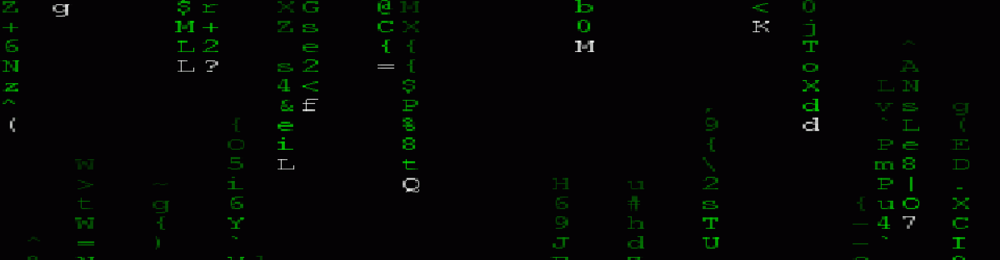

  

<h1 align="center"><code style="color: #00ff00;">Hi there 👋 I'm MichalRedm</code></h1>

  <em style="color: #00ff00;">
    "Follow the white rabbit... into the world of AI, code, and systems built to scale."
  </em>

---

> ## 🧬 `About Me`

🎓 3rd-year Artificial Intelligence student @ Poznań University of Technology  
🧑‍💻 10+ years of web development fun & learning  
🧠 Passionate about AI, clean code, full-stack harmony  
🌍 Based in Poland 🇵🇱  
🔄 Eternal learner

---

> ## 🧰 `Tech Stack`

  

### 🧪 Current Focus

- 🤖 NLP, ML & Large Language Models  
- 🏗 Full‑stack systems with DRY principles  
- 🧬 Generative AI & creative model experimentation

---

> ## 🧭 `Journey Highlights`

- 🔍 Python — 2.5+ years mastering data & ML pipelines  
- 💻 React + TypeScript — dynamic, type-safe interfaces  
- 🛠 Node.js — robust backend & API design  
- 🐳 Docker, Git, Linux — devops fundamentals  
- 🥧 MongoDB & MySQL — NoSQL & SQL experience  
- 📐 Software architecture & clean design patterns  
- 🤝 Creator of [LLM Reasoning Experiment](https://github.com/MichalRedm/llm-reasoning-experiment)

---

> ## 💡 `Learning Goals`

- 🧠 Dive deeper into NLP, ML & speech systems  
- 🔁 Build unified architectures for frontend/backend sharing  
- ☁️ Deploy scalable, AI-driven applications  
- 🎭 Explore multi‑modal and voice‑free interaction systems

---

> ## 🌌 `Contact & Links`

📫 [LinkedIn](https://www.linkedin.com/in/micha%C5%82-redmer/)  
📁 [My GitHub Projects](https://github.com/MichalRedm?tab=repositories)  
🧠 Let’s connect over code, models, or wild ideas…

---

  <em style="color: #00ff00;">
    "There is no spoon." —Neo  
     But there is Python, TypeScript, and infinite possibilities...
  </em>

